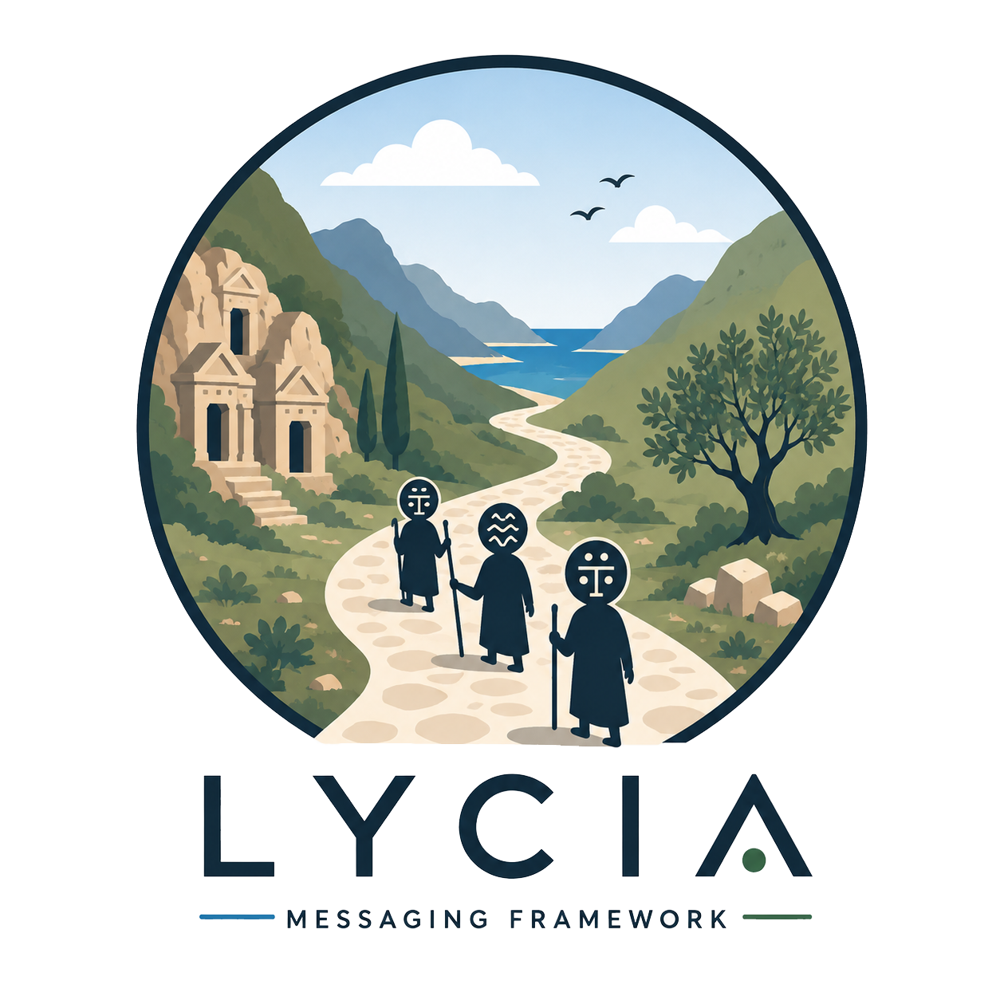

<p align="center">
  
</p>

# Lycia

## Split Store persistence

Split Store explicitly makes PostgreSQL or SQL Server canonical and Redis an asynchronously reconciled,
rebuildable operational projection. Inbox, canonical Saga state, Outbox, and reconciliation intent share
one service-local relational transaction; Redis is never written before that commit.

```csharp
lycia.UsePersistence()
    .WithPostgreSqlCanonicalSagaStore(o => o.ConnectionString = postgres)
    .WithPostgreSqlInbox(o => o.ConnectionString = postgres)
    .WithPostgreSqlOutbox(o => o.ConnectionString = postgres)
    .WithRedisOperationalSagaStore(o => o.ConnectionString = redis)
    .RequireAtomicBoundary()
    .UseSplitStore();
```

Handler reads remain canonical, so Outbox dispatch is independent of Redis reconciliation. Redis loss
can be repaired from the latest canonical materialization without executing handlers. This remains
at-least-once delivery and is not Phase 6 historical replay.

[](https://www.nuget.org/packages/Lycia)
[](https://www.nuget.org/packages/Lycia)

[](https://github.com/gokayokutucu/lycia/actions/workflows/dotnet.yml)
[](https://opensource.org/licenses/Apache-2.0)
[](https://github.com/gokayokutucu/lycia/releases)

**Lycia** is a message-driven saga framework for .NET applications.

It provides:

- coordinated sagas for orchestration
- reactive sagas for choreography
- durable saga state and compensation tracking
- strongly typed command ownership
- asynchronous targeted responses
- configurable middleware
- transport-independent scheduling
- RabbitMQ, NATS and Kafka integrations
- OpenTelemetry tracing hooks

Lycia is designed for distributed systems where workflows span multiple services, messages may be delivered more than once, replicas process work concurrently and failures can occur between individual steps.

The framework follows **at-least-once delivery semantics**. It does not claim exactly-once application processing. Handlers and external side effects must remain idempotent.

For implementation details, compensation behavior, transport topology and integration-test strategies, see [DEVELOPERS.md](DEVELOPERS.md).

---

## Packages

Lycia is split into focused packages.

| Package | Purpose |
| --- | --- |
| `Lycia` | Core saga abstractions, handlers, dispatching, compensation and saga context |
| `Lycia.Extensions` | Transport- and persistence-independent registration, configuration, middleware, serialization, logging, retry |
| `Lycia.Extensions.RabbitMq` | RabbitMQ EventBus, topology, queues, exchanges, bindings, DLQ behavior and RabbitMQ TTL/DLX scheduling strategy |
| `Lycia.Extensions.Scheduling` | Durable transport-independent scheduling, scheduler workers, Redis schedule storage, manifests, leases and vacuum workers |
| `Lycia.Extensions.Nats` | NATS Core and JetStream transport integration |
| `Lycia.Extensions.Kafka` | Kafka transport integration |
| `Lycia.Extensions.OpenTelemetry` | OpenTelemetry tracing and propagation integration |
| `Lycia.Persistence.InMemory` | In-memory `ISagaStore`/`IInboxStore`/`IOutboxStore` provider. Tests and local development only — not durable production storage |
| `Lycia.Persistence.Redis` | Redis-backed `ISagaStore`/`IInboxStore`/`IOutboxStore` provider with atomic optimistic concurrency and Lua-script Inbox/Outbox claims |
| `Lycia.Persistence.SqlServer` | SQL Server-backed `ISagaStore`/`IInboxStore`/`IOutboxStore` provider with embedded schema migration |
| `Lycia.Persistence.PostgreSql` | PostgreSQL-backed `ISagaStore`/`IInboxStore`/`IOutboxStore` provider with embedded schema migration |

RabbitMQ and scheduling are intentionally separate packages.

`Lycia.Extensions.Scheduling` does not depend on RabbitMQ. Transport-specific scheduling strategies remain inside their transport packages.

`Lycia.Extensions` does not depend on any concrete persistence-provider package. Each
`Lycia.Persistence.*` package contributes its own `With...SagaStore()` method to the shared
`LyciaPersistenceBuilder` DSL type, the same way transport packages extend `LyciaTransportBuilder`.

---

## Installation

Install the core and shared extensions packages:

```bash
dotnet add package Lycia
dotnet add package Lycia.Extensions
```

Install one transport package:

```bash
dotnet add package Lycia.Extensions.RabbitMq
```

Install exactly one SagaStore persistence provider:

```bash
dotnet add package Lycia.Persistence.Redis
# or: Lycia.Persistence.InMemory / Lycia.Persistence.SqlServer / Lycia.Persistence.PostgreSql
```

Optional packages:

```bash
dotnet add package Lycia.Extensions.Scheduling
dotnet add package Lycia.Extensions.OpenTelemetry
```

NATS and Kafka transports are available separately:

```bash
dotnet add package Lycia.Extensions.Nats
dotnet add package Lycia.Extensions.Kafka
```

---

## Minimal Setup

Register Lycia, discover saga handlers and select a transport with the nested fluent DSL. The
callback boundary itself finalizes registration, so there is no separate `.Build()` call:

```csharp
services.AddLycia(configuration, lycia =>
{
    lycia
        .AddSagas()
            .FromCurrentAssembly();

    lycia
        .UseTransport()
            .RabbitMq();

    lycia
        .UsePersistence()
            .WithRedisSagaStore(options =>
            {
                options.ConnectionString = configuration.GetConnectionString("Redis");
            });
});
```

The DSL is nested by concern but stays fluent: `AddSagas()` starts saga discovery,
`UseTransport()` selects a transport provider, `UsePersistence()` selects the SagaStore provider,
`AddScheduling()` (from `Lycia.Extensions.Scheduling`) configures durable scheduling, and
`AddMiddleware()` configures the logging/retry/tracing pipeline. Transport and persistence
registration are both explicit — `AddLycia` does not pick a transport or a SagaStore for you.
Selecting two different transport providers on the same registration (for example
`UseTransport().RabbitMq()` followed by `UseTransport().Nats()`) fails clearly instead of silently
letting the second call win, and the same guard applies to `UsePersistence()`:
`.WithRedisSagaStore(...)` followed by `.WithPostgreSqlSagaStore(...)` throws
`"Multiple SagaStore providers were configured..."` rather than silently keeping the last one.
Exactly one SagaStore provider is required; if none is selected, resolving `ISagaStore` throws a
clear configuration error naming the missing provider packages, instead of silently falling back
to an in-memory store.

Provider selection is always an explicit method call — never a configuration string. Configuration
(`IConfiguration`/`IOptions`) may still supply provider *values* such as connection strings, schema
names, timeouts, and credentials, as shown above.

`Lycia.Extensions` never depends on a transport, scheduling, or persistence-provider package.
Each package contributes its own methods to the shared `LyciaTransportBuilder` /
`LyciaPersistenceBuilder` / `LyciaBuilder` DSL types instead (for example
`Lycia.Extensions.RabbitMq` adds `.RabbitMq()` to `UseTransport()`), so IntelliSense stays scoped
to what is actually installed.

<details>
<summary>Migrating from the older direct APIs</summary>

The previous flat form still compiles and is now a thin, `[Obsolete]`-marked wrapper around the
same registration logic:

```csharp
services
    .AddLycia(configuration)
    .AddSagasFromCurrentAssembly()
    .Build();

services.AddLyciaRabbitMq();
```

`AddLyciaRabbitMq()`, `AddLyciaNats(...)`, `AddLyciaKafka(...)`, `AddLyciaScheduling(...)`, and
`AddLyciaInMemoryScheduling(...)` continue to work unchanged; each obsolete warning names its DSL
replacement.

</details>

---

## Saga Models

Lycia supports two saga models.

### Coordinated Saga

A coordinated saga uses a central orchestrator and durable `TSagaData`.

Use it when:

- workflow order must be explicit
- responses determine subsequent commands
- compensation must follow a controlled path
- workflow state must survive process restarts
- multiple replicas may continue the same saga

### Reactive Saga

A reactive saga implements choreography.

Each handler reacts independently to an event without a central orchestrator or cross-step `TSagaData`.

Use it when:

- services should remain autonomous
- multiple independent subscribers react to the same fact
- no central component should own the complete workflow
- eventual consistency is acceptable

---

## Coordinated Saga Example

```csharp
public sealed class CreateInvoiceSagaHandler
    : StartCoordinatedSagaHandler<CreateInvoiceCommand, CreateInvoiceSagaData>
{
    public override async Task HandleAsync(
        CreateInvoiceCommand command,
        CancellationToken cancellationToken = default)
    {
        await Context.Send(
            new ReserveCreditCommand
            {
                InvoiceId = command.InvoiceId
            },
            cancellationToken);

        await Context.MarkAsComplete<CreateInvoiceCommand>(
            cancellationToken);
    }
}
```

Coordinated sagas persist state between message deliveries. The next step may execute on another process, container or Kubernetes replica.

---

## Reactive Saga Example

```csharp
public sealed class InventorySagaHandler
    : ReactiveSagaHandler<OrderCreatedEvent>,
      ISagaCompensationHandler<PaymentFailedEvent>
{
    public override async Task HandleAsync(
        OrderCreatedEvent message,
        CancellationToken cancellationToken = default)
    {
        await Context.Publish(
            new InventoryReservedEvent
            {
                OrderId = message.OrderId
            },
            cancellationToken);

        await Context.MarkAsComplete<OrderCreatedEvent>(
            cancellationToken);
    }

    public Task CompensateAsync(
        PaymentFailedEvent message,
        CancellationToken cancellationToken = default)
    {
        InventoryService.ReleaseStock(message.OrderId);
        return Task.CompletedTask;
    }
}
```

Reactive sagas are stateless at the Lycia saga-data level. Each event is processed independently.

---

## Strongly Typed Command Ownership

Commands declare one logical owner through an endpoint marker.

No queue name, destination string or handler class name is passed to `Send`.

```csharp
public interface IStockServiceCommand : ICommandEndpoint
{
}

public sealed class ReserveStockCommand
    : CommandBase,
      IStockServiceCommand
{
    public Guid OrderId { get; init; }
}
```

The command handler belongs to the application that owns the endpoint:

```csharp
public sealed class ReserveStockHandler
    : CoordinatedSagaHandler<ReserveStockCommand, StockSagaData>
{
    public override Task HandleAsync(
        ReserveStockCommand command,
        CancellationToken cancellationToken = default)
    {
        return Context.MarkAsComplete<ReserveStockCommand>(
            cancellationToken);
    }
}
```

Send the command without transport-specific routing information:

```csharp
await Context.Send(
    new ReserveStockCommand
    {
        OrderId = orderId
    },
    cancellationToken);
```

`IStockServiceCommand` resolves deterministically to the logical owner `StockService`.

The owning host must use an equivalent canonical `ApplicationId`.

Startup validation rejects:

- commands without an owner endpoint
- commands with multiple owner endpoints
- handlers registered in the wrong logical application
- multiple handler types claiming the same owned command in one application

Commands represent intentions and have one logical owner. Events represent facts and may have multiple subscribers.

---

## Canonical Application Identity

Application identities are normalized using invariant lowercase rules.

The following values are equivalent:

```text
StockService
stock-service
stock_service
STOCK.SERVICE
stock service
```

They normalize to:

```text
stockservice
```

Dashes, underscores, dots and whitespace are ignored. Values must contain at least one alphanumeric character.

Every replica of the same logical application must use the same `ApplicationId`.

```text
Correct:

StockService replica 1 -> StockService
StockService replica 2 -> StockService
StockService replica 3 -> StockService
```

Do not encode replica identity into `ApplicationId`:

```text
Incorrect:

StockService-1
StockService-2
StockService-3
```

Correctly configured replicas share the same queue, durable consumer or consumer group and compete for work.

The invariant is:

> One logical handler type, many runtime handler instances.

---

## Transport Semantics

Lycia exposes the same messaging semantics across transports while allowing each transport package to implement its native topology.

| Message kind | RabbitMQ | NATS | Kafka |
| --- | --- | --- | --- |
| Command | Direct exchange and one logical owner queue | Owner subject and one durable consumer | Owner topic and one consumer group |
| Event | Fan-out to one queue per subscription | One durable consumer per subscription | One consumer group per subscription |
| Response | Targeted requester queue | Targeted response subject | Targeted response topic/group |

Example command topology:

| Transport | Address |
| --- | --- |
| RabbitMQ | Exchange `command.ReserveStockCommand`, queue `command.ReserveStockCommand.StockService`, routing key `StockService` |
| NATS | Subject `command.StockService.ReserveStockCommand` |
| Kafka | Topic `lycia.command.StockService.ReserveStockCommand` |

Lycia does not create one queue, subject, topic or consumer group per saga instance.

---

## Asynchronous Targeted Responses

Lycia does not use synchronous RPC-style waiting for saga steps.

Responses are asynchronous messages targeted to the logical application that is waiting for them.

```csharp
await Context.Respond(
    request,
    new InventoryReservedResponse
    {
        OrderId = request.OrderId
    },
    cancellationToken);
```

A response:

- has its own `MessageId`
- preserves the workflow `CorrelationId`
- preserves the durable `SagaId`
- uses `RequestId` to identify the request it answers
- uses `ResponseEndpoint` to route back to the requester
- may be consumed by any replica of the requester application

Responses must be sent with `Respond`.

Publishing an `IResponse` through `Context.Publish` fails explicitly because responses are targeted continuations, not broadcast facts.

`ReplyTo` remains an obsolete compatibility alias for `ResponseEndpoint`.

---

## Message Identity

Lycia separates concrete message identity, request-response identity, workflow correlation and compensation lineage.

| Field | Meaning |
| --- | --- |
| `MessageId` | Unique identity and idempotency key of the concrete message |
| `RequestId` | Identifies the request answered by a response |
| `CorrelationId` | Groups the complete business workflow |
| `CausationId` | Identifies the direct message that caused this message |
| `ParentMessageId` | Defines saga-step and compensation lineage |
| `SagaId` | Identifies the durable saga instance |
| `ResponseEndpoint` | Identifies the logical requester application |

Example:

```text
CreateOrderCommand
MessageId        = M1
RequestId        = M1
CorrelationId    = C1
CausationId      = null
ParentMessageId  = empty
SagaId           = S1
```

```text
OrderCreatedResponse
MessageId        = M2
RequestId        = M1
CorrelationId    = C1
CausationId      = M1
ParentMessageId  = M1
SagaId           = S1
```

```text
ReserveInventoryCommand
MessageId        = M3
RequestId        = M3
CorrelationId    = C1
CausationId      = M2
ParentMessageId  = M2
SagaId           = S1
```

Compensation traverses `ParentMessageId`.

`CausationId` is used for direct causal tracing and does not replace the compensation lineage.

---

## Replica-Safe Continuation

A saga step does not depend on the process that sent the preceding message remaining alive.

```text
Replica A
  -> sends ReserveInventoryCommand
  -> process stops

Replica B
  -> receives InventoryReservedResponse
  -> loads SagaId from the SagaStore
  -> continues the workflow
```

This is one of the central differences between Lycia’s asynchronous response model and process-local request-response implementations that keep pending requests in memory.

---

## RabbitMQ

Install:

```bash
dotnet add package Lycia.Extensions.RabbitMq
```

Register:

```csharp
services.AddLycia(configuration, lycia =>
{
    lycia
        .AddSagas()
            .FromCurrentAssembly();

    lycia
        .UseTransport()
            .RabbitMq(); // or .RabbitMq(options => { ... }) for code-first overrides
});
```

The RabbitMQ package owns:

- `RabbitMqEventBus`
- queue and exchange declaration
- command/event/response routing
- dead-letter behavior
- RabbitMQ message-header normalization
- RabbitMQ scheduling topology
- fixed TTL and DLX scheduling buckets

### Consumer readiness

RabbitMQ consumers expose an explicit readiness signal once their mapped queues, bindings and consumers have been registered.

This avoids startup and integration-test races where a message could be published before its binding exists.

Consumer readiness is a lifecycle signal. Applications should not wait for it before every individual publish.

---

## Durable Message Scheduling

Install:

```bash
dotnet add package Lycia.Extensions.Scheduling
```

Register Redis-backed scheduling as part of the same `AddLycia` DSL. Safe defaults apply, so the
minimal registration needs no dispatch tuning at all:

```csharp
lycia
    .AddScheduling()
        .WithRedisStore()
        .WithPredefinedDelays();
```

`WithPredefinedDelays()` sets `AllowDynamicDelays = false`; use `WithDynamicDelays()` for
`AllowDynamicDelays = true`. Both are semantic aliases over the same `SchedulingOptions` property —
nothing was removed, so code that still sets `options.AllowDynamicDelays` directly keeps working.

Tune dispatch lease/claim behavior and enable Vacuum only when the defaults do not fit:

```csharp
lycia
    .AddScheduling()
        .WithRedisStore()
        .WithPredefinedDelays()
        .WithDispatch(options =>
        {
            options.LeaseDuration = TimeSpan.FromSeconds(30);
            options.LeaseRenewInterval = TimeSpan.FromSeconds(10);
        })
        .WithVacuum(options =>
        {
            options.ApplicationTopology.Mode = VacuumMode.ReportOnly;
        });
```

`WithDispatch(...)` configures batching, claim lifetime, lease renewal, and bounded
backoff-with-jitter retry for due-schedule dispatch — it replaces `WithWorker(...)`, which remains
available as an `[Obsolete]` wrapper over the same `SchedulingOptions.Worker` settings for existing
callers. `WithVacuum(...)` is unrelated and unchanged.

Schedule a message:

```csharp
var scheduleId = await Context.Schedule(
    new CancelOrderCommand
    {
        OrderId = orderId
    },
    ScheduleDelay.ThirtySeconds,
    cancellationToken);
```

`ScheduleId` identifies the scheduling operation and is intentionally different from `MessageId`.

Pass a stable `ScheduleId` when retrying schedule creation.

Pending schedules may be cancelled or rescheduled idempotently before dispatch.

### Fixed and dynamic delays

Predefined RabbitMQ delay buckets use one fixed-TTL queue per destination and delay bucket, then dead-letter the message to its final destination.

This does not require the `x-delayed-message` plugin.

Dynamic RabbitMQ delay buckets are opt-in because arbitrary durations may create additional queues.

Kafka uses durable scheduling dispatch (`WithDispatch(...)`); Kafka retention is not treated as
delayed delivery.

The current validated NATS baseline also uses durable scheduling dispatch rather than delay buckets.

### Scheduling reliability

Scheduling dispatch follows at-least-once semantics around crash and confirmation windows. A due
schedule is claimed under a fencing-token-protected lease (owner and fence both validated, not
lease-expiry alone), so a stale or resumed owner cannot re-claim work another live owner still
holds. Failed dispatch attempts retry with bounded exponential backoff and jitter, the same pattern
Outbox and reconciliation already use.

Consumers must remain idempotent.

Dynamic resource cleanup requires:

- exact registry provenance
- no active schedule or manifest
- empty and unused broker resources
- lease ownership
- fencing protection
- explicit cleanup policy

Predefined delay buckets are retained.

Ordinary application topology defaults to report-only inspection and requires explicit destructive opt-in before deletion.

---

## Middleware

Lycia includes a replaceable middleware pipeline, configured through the same `AddLycia` DSL:

```csharp
lycia
    .AddMiddleware()
        .WithLogging()
        .WithRetry(options => options.MaxRetryAttempts = 5)
        .WithTracing();
```

Default middleware slots include:

- logging
- retry
- tracing

Implementations may be replaced through the generic form of each method
(`WithLogging<TMiddleware>()`, `WithRetry<TMiddleware>()`, `WithTracing<TMiddleware>()`), which
drives the same three interfaces the pipeline has always used:

- `ILoggingSagaMiddleware`
- `IRetrySagaMiddleware`
- `ITracingSagaMiddleware`

The default tracing implementation uses `ActivityTracingMiddleware`.

Retry behavior is provided through `IRetryPolicy`, with a Polly-based default implementation supporting:

- bounded retries
- exponential backoff
- jitter
- exception-specific policies

Retries do not replace Inbox, Outbox or idempotency guarantees.

---

## OpenTelemetry Tracing

Install:

```bash
dotnet add package OpenTelemetry
dotnet add package OpenTelemetry.Exporter.OpenTelemetryProtocol
dotnet add package Lycia.Extensions.OpenTelemetry
```

Configure tracing:

```csharp
services
    .AddOpenTelemetry()
    .AddLyciaTracing()
    .WithTracing(tracing =>
    {
        tracing.AddAspNetCoreInstrumentation();

        tracing.AddOtlpExporter(options =>
        {
            options.Endpoint =
                new Uri("http://otel-collector:4317");
        });
    });
```

Lycia emits tracing data for saga and messaging operations without requiring tracing code inside saga handlers.

Typical attributes include:

```text
lycia.saga.id
lycia.message.id
lycia.request.id
lycia.correlation.id
lycia.causation.id
lycia.parent_message.id
lycia.application.id
lycia.saga.step.status
```

W3C `traceparent` and `tracestate` headers are propagated through supported message transports.

The resulting traces may be exported through OpenTelemetry Collector to systems such as:

- Grafana Tempo
- Jaeger
- another OpenTelemetry-compatible backend

OpenTelemetry provides instrumentation, propagation and export. The selected tracing backend provides storage, querying and visualization.

Long-running asynchronous workflows should continue to rely on Lycia’s durable identifiers such as `CorrelationId`, `SagaId`, `CausationId` and `ParentMessageId`, rather than assuming that one indefinitely open trace span represents the complete business workflow.

---

## Idempotency and Concurrency

Lycia treats idempotency and concurrency as separate concerns.

### Idempotency

Idempotency prevents duplicate handling of the same logical message.

```text
Same MessageId delivered twice
-> committed business effect executes once
```

The optional Inbox enforces this at the handler-execution boundary, before saga-state work begins:

```csharp
services.AddLycia(configuration, lycia =>
{
    lycia
        .UsePersistence()
            .WithRedisSagaStore(options => options.ConnectionString = redisConnection)
            .WithRedisInbox(options => options.ConnectionString = redisConnection); // disabled by default
});
```

`IInboxStore` is resolved optionally — dispatch behaves exactly as it did before Inbox existed when
nothing is registered.

### Optimistic concurrency

Optimistic concurrency prevents different valid messages from overwriting the same saga state.

```text
Saga version = 7

Replica A processes InventoryReservedResponse
Replica B processes PaymentTimeoutEvent

Both load version 7.
Only one may commit version 8.
```

At-least-once transport delivery means duplicate delivery remains possible.

Handlers and external integrations must use stable message identities and idempotent business operations.

---

## Extensibility

Lycia’s core abstractions are replaceable.

Applications and extension packages may provide custom implementations of:

- `IEventBus`
- `ISagaStore`
- `IInboxStore` / `IOutboxStore` (optional, disabled by default)
- `IMessageSerializer`
- middleware slots
- retry policies
- tracing integrations
- scheduling storage and strategies

Transport-specific behavior remains outside the core package.

`lycia.UsePersistence()` exposes the SagaStore providers through the same nested DSL —
`WithInMemorySagaStore()`, `WithRedisSagaStore(...)`, `WithSqlServerSagaStore(...)`, and
`WithPostgreSqlSagaStore(...)` — each contributed by its own package. `Lycia.Extensions` itself only
defines `LyciaPersistenceBuilder` and its duplicate-provider guard; it never depends on a concrete
provider package. The atomic persistence-boundary policy, Split Store, and the canonical journal all
extend `LyciaPersistenceBuilder` the same way, without changing this dependency direction.

---

## Samples

The [samples/](samples) directory contains runnable examples.

| Sample | Purpose |
| --- | --- |
| `Sample.Order.Api` | API entry point and initial command submission |
| `Sample.Order.Orchestration.Consumer` | Stateful coordinated saga with asynchronous targeted responses |
| `Sample.Order.Choreography.Consumer` | Stateless event-driven reactive saga |
| `Sample.Order.Orchestration.Seq.Consumer` | Sequential coordinated saga with compensation |

Samples demonstrate:

- strongly typed command ownership
- canonical `ApplicationId`
- replica-safe response consumption
- RabbitMQ transport registration
- saga persistence
- compensation
- scheduling
- OpenTelemetry integration

---

## Current Reliability Model

Lycia currently provides and prepares for:

- at-least-once message delivery
- message identity propagation
- handler idempotency
- saga-state persistence
- optimistic concurrency
- compensation traversal
- broker acknowledgement handling
- RabbitMQ DLQ behavior
- bounded retry policies with backoff and jitter (Outbox, Reconciliation, and scheduling dispatch)
- publisher confirmation integration where supported
- durable scheduling with fencing-token-protected lease ownership (scheduler dispatch and Vacuum)
- a safe, secret-free reliability/topology diagnostics snapshot (`ILyciaReliabilityDiagnostics`)

Durable Inbox/Outbox provider stores exist for InMemory, Redis, SQL Server, and PostgreSQL. Selecting
an Outbox replaces the direct outgoing pipeline with durable capture for `Context.Send`,
`Context.Publish`, `Context.Respond`, and their tracked variants. `OutboxWorker` then restores the
original event-bus semantic; without an Outbox the historical direct behavior is unchanged.

The model distinguishes:

```text
Saga state
-> workflow and compensation state

Inbox
-> committed processing identity of incoming messages

Outbox
-> durable publication lifecycle of outgoing messages
```

The saga state machine does not replace Inbox or Outbox. When SQL Server or PostgreSQL backs every
enabled store with the same normalized database identity, these concerns share one service-local
transaction automatically; they remain separate durable lifecycles.

**Idempotency** prevents duplicate handling of the same logical message — Inbox implements this at
the handler-execution level: `IInboxStore.TryBeginAsync(messageId, handlerType)` claims a
(MessageId, HandlerType) pair before the handler body runs; a redelivered message for the same pair
returns `AlreadyProcessing`/`AlreadyCompleted`/`AlreadyFailed` instead of re-running the handler.
This is optional and disabled by default — enable it via `UsePersistence().WithInMemoryInbox()` /
`.WithRedisInbox()` / `.WithSqlServerInbox()` / `.WithPostgreSqlInbox()`. It is complementary to, not
a replacement for, the existing per-step transition/duplicate-payload checks in
`ISagaStore.LogStepAsync`.

**Outbox** durably captures outgoing message intent (`IOutboxStore.AddAsync`, idempotent on
`MessageId`) with an explicit lifecycle (`Pending` → `Claimed` → `Publishing` →
`Published`/`ConfirmationUnknown`/`Failed`). Durable stores exist for InMemory, Redis, SQL Server,
and PostgreSQL — enable one via `.WithInMemoryOutbox()` / `.WithRedisOutbox()` /
`.WithSqlServerOutbox()` / `.WithPostgreSqlOutbox()`. Provider selection also registers the hosted
worker; tune it with `.WithOutboxWorker(options => ...)`. An `IOutboxDispatcher` claims pending or
retryable `ConfirmationUnknown` messages (safe under concurrent callers — one worker wins each
message) and restores `Send`, `Publish`, or targeted `Respond` through the application's `IEventBus`:

```csharp
lycia.UsePersistence()
    .WithRedisSagaStore(options => options.ConnectionString = redisConnection)
    .WithRedisOutbox(options => options.ConnectionString = redisConnection)
    .WithOutboxWorker(options =>
    {
        options.BatchSize = 50;
        options.MaxAttempts = 5;
        options.RecoveryTimeout = TimeSpan.FromMinutes(1); // longer than transport publish timeout
        options.RetryBackoff = TimeSpan.FromMilliseconds(250);
    });
```

```csharp
var result = await outboxDispatcher.DispatchPendingBatchAsync(maxCount: 50);
// result.Published / result.ConfirmationUnknown / result.Failed
```

`Published` requires the transport-neutral `IConfirmedEventBus` capability. Kafka's idempotent
`acks=all` producer and NATS JetStream expose positive acceptance and implement it. Core NATS and the
current RabbitMQ publisher do not claim a broker confirmation, so a completed attempt remains
`ConfirmationUnknown` and is redispatched up to the configured bound with backoff and jitter. This
is intentionally at least once: `MessageId`/`OutboxId` remain stable and consumers must be idempotent.
Permanent local envelope/type/serialization failures become `Failed`.

Claims left in `Claimed`/`Publishing` by a crashed process become eligible after `RecoveryTimeout`.
Set it longer than the transport publish timeout. Recovery can duplicate a publish whose original
worker was only slow, which is another explicit at-least-once window rather than a fencing claim.

Scheduling remains the sole owner of not-yet-due intent. When a schedule becomes due, scheduling
dispatch hands `Send`/`Publish`/`Respond` to the same outgoing pipeline; with Outbox enabled this
creates one Outbox record at due time rather than two competing durable records.

### Atomic Lycia persistence boundary

The persistence-boundary policy defaults to `Auto`. SQL Server or PostgreSQL SagaStore, Inbox, and
Outbox stores that resolve to the same logical database use `LocalAtomic` automatically. Different
schemas in that database may participate because each store uses schema-qualified tables; different
databases or mixed providers resolve to `Independent`.

```csharp
lycia.UsePersistence()
    .WithPostgreSqlSagaStore(options => options.ConnectionString = postgres)
    .WithPostgreSqlInbox(options => options.ConnectionString = postgres)
    .WithPostgreSqlOutbox(options => options.ConnectionString = postgres);
// Auto -> LocalAtomic
```

Use `.RequireAtomicBoundary()` to make an incompatible topology fail during startup validation, or
`.UseIndependentTransactions()` to deliberately opt out when a compatible local boundary exists.
There is no `WithAutomaticConsistency()`, `WithStrongConsistency()`, or `AllowNonAtomicBoundary()`;
mixed topology is a valid automatic Independent configuration.

The local transaction covers only the enabled Lycia Inbox, SagaStore, and Outbox operations in one
service. It never spans service A's Outbox and service B's Inbox, never uses a distributed
transaction, and does not automatically enlist application business tables. Outbox publication
happens after commit. If COMMIT is issued but its result cannot be observed, Lycia reports an unknown
outcome and does not blindly rerun the handler; durable identities must be checked during recovery.

**Lycia provides at-least-once delivery semantics. It does not claim exactly-once processing.**
Inbox reduces duplicate-processing risk; Outbox reduces the local-store/broker dual-write window when
used correctly. Neither changes Lycia's fundamental at-least-once delivery guarantee.

### Reliability diagnostics

`ILyciaReliabilityDiagnostics` composes a safe, secret-free snapshot of the active persistence
topology from signals that already exist elsewhere (`IPersistenceTopology`, and which of
Inbox/Outbox/journal/rebuild are actually registered) rather than tracking a second, independently
maintained copy of that state. It is registered automatically by `AddLycia`:

```csharp
var snapshot = serviceProvider
    .GetRequiredService<ILyciaReliabilityDiagnostics>()
    .GetSnapshot();

// snapshot.Mode, snapshot.CanonicalStore, snapshot.OperationalStore, snapshot.ResolvedStrategy,
// snapshot.ReconciliationEnabled, snapshot.JournalEnabled, snapshot.JournalRebuildAvailable,
// snapshot.InboxEnabled, snapshot.OutboxEnabled, snapshot.DeliveryGuarantee ("AtLeastOnce")
```

The snapshot never includes connection strings, credentials, or message payloads — only provider
names, capability flags, and the resolved transaction boundary. It is a plain read model, not a
health check or UI; use it to back a custom startup log line or diagnostics endpoint.

---

## Roadmap

Current architectural priorities include:

### Persistence Providers

Implemented today (SagaStore only):

- `Lycia.Persistence.InMemory`
- `Lycia.Persistence.Redis`
- `Lycia.Persistence.SqlServer`
- `Lycia.Persistence.PostgreSql`

All four implement `ISagaStore` against one shared conformance test suite and provide explicit
numeric optimistic concurrency (`IVersionedSagaStore`) — `SaveSagaDataAsync(id, data, expectedVersion)`
throws `SagaConcurrencyException` when the stored version has moved on, the same relational
`UPDATE ... WHERE Version = @expected` pattern for SQL Server/PostgreSQL and an atomic Lua
compare-and-set for Redis. Exactly one SagaStore provider may be selected per application;
selecting a second throws immediately at configuration time. SQL Server and PostgreSQL manage their
own schema via an embedded migration (`ApplyMigrations` by default).

Also implemented: Split Store (`.UseSplitStore()`, PostgreSQL/SQL Server canonical + Redis operational,
see "Split Store persistence" above) and the canonical journal + deterministic replay/rebuild engine
(see "Canonical Journal + Replay/Rebuild" below).

Also implemented: a safe, secret-free reliability/topology diagnostics snapshot
(`ILyciaReliabilityDiagnostics`, see "Reliability diagnostics" above).

Not yet built — still future work, not implemented and not to be assumed available:

- broad distributed leases/fencing beyond the fencing-token CAS already used by scheduling dispatch,
  Vacuum, and Split Store reconciliation/rebuild
- persistence health checks beyond `ISagaStoreHealthCheck` and the reliability diagnostics snapshot

### Inbox and Outbox

Implemented today:

- `IInboxStore` / `IOutboxStore` provider-neutral contracts, in `Lycia.Saga.Abstractions`
- `InboxMessageStatus`/`InboxBeginResult` and `OutboxMessageStatus`/`OutboxMessage` models
- Durable Inbox/Outbox stores for **InMemory** (deterministic, tests only), **Redis**
  (`RedisInboxStore`/`RedisOutboxStore` — atomic claim via `SETNX`/Lua scripts, standalone/non-clustered
  Redis only; cross-key Lua atomicity is not Cluster-safe without hash tags, which are not used here),
  **SQL Server** (`LyciaInbox`/`LyciaOutbox` tables, `UPDATE TOP (@n) ... OUTPUT INSERTED.*` for safe
  concurrent claiming), and **PostgreSQL** (`lycia_inbox`/`lycia_outbox` tables with `jsonb` payload
  columns, `FOR UPDATE SKIP LOCKED` for safe concurrent claiming)
- `UsePersistence().WithInbox<T>()` / `.WithOutbox<T>()` generic DSL, plus named sugar per provider —
  `.WithInMemoryInbox()`/`.WithInMemoryOutbox()`, `.WithRedisInbox()`/`.WithRedisOutbox()`,
  `.WithSqlServerInbox()`/`.WithSqlServerOutbox()`, `.WithPostgreSqlInbox()`/`.WithPostgreSqlOutbox()` —
  all optional and disabled by default, each with the same duplicate-provider guard as SagaStore
- `SagaDispatcher` Inbox integration: claims (MessageId, HandlerType) before invoking a handler and
  marks it completed/failed afterward, with zero behavior change when no `IInboxStore` is registered
- `IOutgoingMessagePipeline`, versioned `OutboxEnvelope`, semantic `OutboxDispatcher`, and hosted
  `OutboxWorker`: automatic Context capture, due-schedule handoff, Send/Publish/Respond restoration,
  bounded redispatch, and the conservative Pending→Claimed→Publishing→Published/ConfirmationUnknown/Failed
  lifecycle described above. Registered whenever an Outbox provider is selected.
- `ILyciaPersistenceSession`/`ILyciaPersistenceSessionFactory` — a real, service-local relational
  transaction boundary (`RelationalPersistenceSession`, backed by `Microsoft.Data.SqlClient`/`Npgsql`)
  shared by enabled SQL Server/PostgreSQL SagaStore, Inbox, and Outbox operations when `Auto` resolves
  `LocalAtomic`. InMemory/Redis remain honestly independent.

Still planned (not implemented):

- RabbitMQ publisher-confirm mode. Kafka's idempotent `acks=all` producer and NATS JetStream
  confirmations are integrated and implement `IConfirmedEventBus`. RabbitMQ.Client 7.x does not expose
  a public API to await broker confirmation per publish (verified directly against the installed
  client), so RabbitMQ intentionally remains `ConfirmationUnknown` rather than faking a confirmation
  signal the transport cannot actually give; Core NATS remains `ConfirmationUnknown` for the same
  honesty reason (no durable server ack outside JetStream)
- fail-closed processing guarantees beyond what SagaStore already provides
- bounded recovery beyond the journal-based rebuild described below

### Canonical Journal + Replay/Rebuild

Split Store requires rebuildability, so `.UseSplitStore()` now also requires a registered
`ISagaJournalStore` — an append-only, immutable canonical transition history distinct from the Phase 5
reconciliation intent (which only re-queues the *latest* row and is not retained ordered history).
Implemented for **SQL Server** and **PostgreSQL** (Redis is the rebuild target, never the canonical
journal); an **InMemory** journal exists for deterministic tests.

```csharp
lycia.UsePersistence()
    .WithPostgreSqlCanonicalSagaStore(o => o.ConnectionString = postgres)   // also registers the journal store
    .WithPostgreSqlInbox(o => o.ConnectionString = postgres)
    .WithPostgreSqlOutbox(o => o.ConnectionString = postgres)
    .WithRedisOperationalSagaStore(o => o.ConnectionString = redis)
    .RequireAtomicBoundary()
    .UseSplitStore();
```

- **Ordering authority**: `SagaId` + `SequenceNumber`. `SequenceNumber` and the existing `SagaData.Version`
  are deliberately the same value — Lycia already has one authoritative per-saga monotonic counter, and
  the journal reuses it instead of inventing a second ordering axis. `CreatedAtUtc` is diagnostic metadata
  only, never used for ordering or gap detection.
- **Atomicity**: journal append happens inside `SplitStoreSagaStore`, in the same call that already writes
  the reconciliation intent, so under `LocalAtomic` both commit or roll back with Inbox/SagaStore/Outbox as
  one unit. A rolled-back transaction leaves no journal row.
- **Entry shape**: each `SagaJournalEntry` carries the full post-transition `SagaData` *and* a full
  snapshot of the saga's step log (not a delta) — this is a deliberate choice to keep the reducer a direct
  projection instead of a fold, and lets rebuild read only a saga's *latest* entry once ordered continuity
  has been validated, rather than replaying every historical entry. Correlation metadata (MessageId,
  RequestId, CorrelationId, CausationId, ParentMessageId, ApplicationId, HandlerType, MessageType) is
  captured by `SagaDispatcher` before invoking a handler (`ISagaJournalContextAccessor`, framework-managed,
  never set by handler code) and is best-effort — `null` when a journal write happens outside a dispatched
  message context.
- **Reducer** (`ISagaJournalReducer`): pure `Reduce(previous, entry) -> newState`. Never resolves
  `IEventBus`, executes a handler, publishes, writes Inbox/Outbox, schedules a message, reads
  `DateTime.UtcNow` as business input, or generates a new identity. The same ordered journal always
  produces the same state.
- **Rebuild engine** (`ISagaRebuildService`, one engine for both automatic recovery and manual/operator
  rebuild): `RebuildSagaAsync`/`RebuildAllAsync` (bounded pages, per-saga failure isolation, progress
  reporting, cancellation, resumable cursor) and `VerifySagaAsync`/`VerifyAllAsync` (non-mutating —
  `Healthy`/`MissingProjection`/`VersionMismatch`/`StateMismatch`/`JournalGap`/`SchemaUnsupported`/
  `CorruptEntry`). Continuity is validated while replaying (gap/backward-transition/wrong-SagaId
  detection) — a corrupt journal is reported clearly, never silently best-effort reconstructed. Rebuild
  installs through the *same* `IOperationalSagaProjectionStore` CAS/version-fencing Split Store
  reconciliation already uses, so a stale rebuild can never overwrite a newer live projection, and
  rebuilding the same saga twice is a safe no-op (no version bump, no new journal entries).
- **Schema evolution**: `IJournalEntryUpcaster`/`JournalEntryUpcastChain` upgrade older
  `JournalSchemaVersion` entries deterministically before reduction; a missing upcaster fails the
  rebuild/verify clearly instead of guessing.
- **Side-effect isolation**: `SagaRebuildService`'s dependencies are the journal store, reducer,
  operational-projection store, canonical SagaStore, and upcast chain — it has no dependency capable of
  invoking a handler, publishing/sending a message, or writing Inbox/Outbox, which is verified by a
  dedicated test inspecting its constructor, not only by a runtime side-effect counter.
- **Debug visibility** (Microservices sample): `GET /debug/sagas/{sagaId}/journal` (safe metadata only —
  sequence, transition kind, message id, handler, target version, schema version; no payload dump),
  `POST /debug/sagas/{sagaId}/rebuild-from-journal`, `GET /debug/sagas/{sagaId}/verify` — distinct from
  the Phase 5 `/debug/projections/{sagaId}/restore`, which restores from the latest canonical row, not
  ordered journal replay.

Not yet built — still future work, not implemented and not to be assumed available:

- a durable snapshot table (deferred: because each journal entry already stores full post-transition
  state rather than a delta, rebuild already reads only the latest entry once continuity is validated —
  the acceleration a snapshot table would provide is largely already realized architecturally; the
  interfaces do not block adding one later)
- wiring SagaStore + Inbox + Outbox operations to actually share replay-time atomicity with the journal
  beyond the append itself
- persistent, queryable rebuild-operation tracking (a resumable cursor exists; a separate operational
  `RebuildOperation` table does not)
- a live, orchestrated Microservices docker-compose HTTP end-to-end run exercising these endpoints under
  a full RabbitMQ/PostgreSQL/Redis stack — the equivalent proof (real SQL Server/PostgreSQL/Redis
  containers, atomic rollback, rebuild-after-Redis-loss, side-effect isolation) is instead validated at
  the persistence-provider integration-test level

### Workflow Visualization

A future Lycia workflow explorer may combine:

- OpenTelemetry spans
- Lycia message identities
- saga state
- Inbox and Outbox lifecycle data

to visualize commands, responses, service boundaries, compensation paths and cross-saga relationships as an interactive workflow graph.

A graph database is not required for the initial implementation. The canonical relational journal and OpenTelemetry metadata provide the necessary lineage.

---

## Design Principles

Lycia follows these principles:

- commands have one logical owner
- events may have multiple subscribers
- responses are targeted, not broadcast
- workflows continue asynchronously
- replicas share logical application identity
- process memory is never the durable workflow boundary
- delivery is at least once
- handlers remain idempotent
- retries are bounded
- transport behavior stays outside the core
- operational guarantees are documented without exactly-once claims

---

## Project History

Lycia began on **May 28, 2023** with the goal of making distributed saga workflows easier to model, operate and understand.

The name is inspired by the Lycian Way and the idea of turning difficult paths into understandable routes.

---

## License

Lycia is licensed under the [Apache License 2.0](LICENSE).
