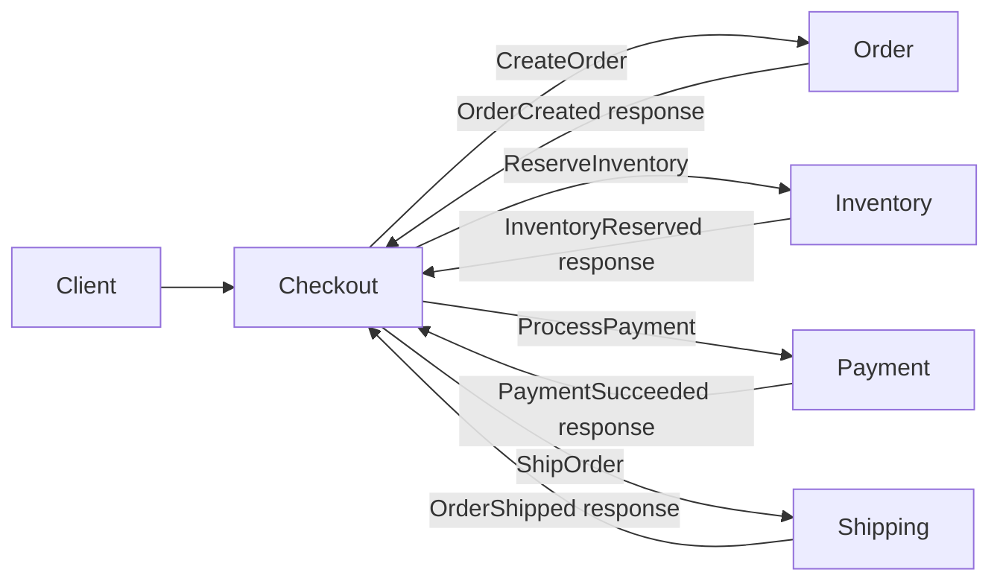

# Split Store microservices proof

This executable .NET 9 sample runs five independently addressable services: Checkout, Order,
Inventory, Payment, and Shipping. RabbitMQ carries commands and targeted responses. Every service
owns a separate PostgreSQL database and a separate Redis instance.



For each service, Inbox, canonical Saga state, Outbox, and reconciliation intent commit in one
service-local PostgreSQL transaction. A worker then installs the resulting versioned state in Redis.
Redis is rebuildable and never participates in the request-path transaction. Outbox publication is
independent of Redis reconciliation because handler reads use canonical PostgreSQL state; a missing or
stale Redis projection cannot become the authority.

This is at-least-once delivery. Inbox suppresses duplicate handler execution; Outbox preserves outgoing
intent. No transaction spans Checkout's Outbox and another service's Inbox. Sample business tables, if
added, are not automatically enlisted in Lycia's local atomic boundary.

Run from this directory:

```bash
docker compose up --build -d
curl -X POST http://localhost:8080/checkout -H 'content-type: application/json' -d '{"orderId":"00000000-0000-0000-0000-000000000000"}'
curl http://localhost:8080/checkouts/<order-id>
```

Use `"failAt":"inventory"` or `"failAt":"payment"` in the checkout request to inject a
deterministic downstream handler failure. The Checkout canonical state remains at the last committed step (`ReservingInventory` or
`ProcessingPayment`). This makes the downstream failure boundary observable without manufacturing a
successful response or advancing the Checkout workflow.

Use `docker compose stop checkout-redis` to demonstrate canonical commits surviving Redis failure,
then `docker compose start checkout-redis` to observe reconciliation. Delete one projection through
`DELETE /debug/projections/{sagaId}` and queue current-state restoration through
`POST /debug/projections/{sagaId}/restore`. This is Phase 5 operational projection restoration, not
Phase 6 historical replay; it never invokes business handlers or creates broker messages.

Inspect canonical state with `docker compose exec postgres psql -U lycia -d checkout_db` and operational
state with `docker compose exec checkout-redis redis-cli GET saga:data:<saga-id>`.
